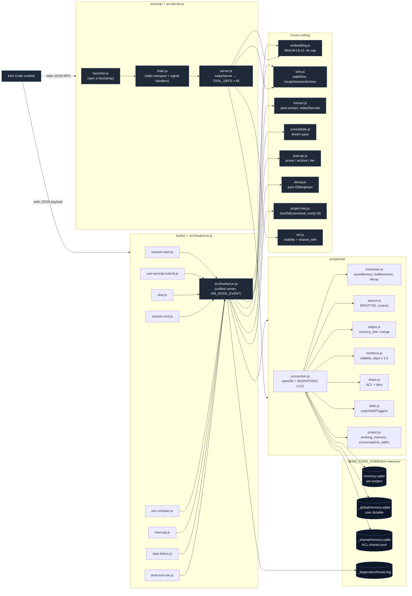

# ARCHITECTURE.md — kimi-memory

Why the code is shaped the way it is, and where the load-bearing decisions
sit. `PROJECT.md` is the operating contract; `CONVENTIONS.md` is the working
contract; this file is the shape. Code that disagrees with any of the three
is a bug; docs that disagree with the code are a doc bug.

A future `shape` or `init --with-document` pass lands here, not a side
rewrite. A future contributor asking "how does this thing hang together?"
gets the answer from this file.

## 1. Map

The plugin is two long-lived Node processes per project plus the host
runtime's hook plumbing: an MCP server that exposes 46 tools to the agent,
and a unified hook runner that handles every lifecycle event. They share a
per-project SQLite database.



ASCII, in case the diagram is read somewhere Mermaid is not rendered:

```
+----------------------+         +------------------------+
|  Kimi Code runtime   |         |  hooks/ (8 scripts)    |
|  (events + stdio)    |         |  all -> src/hooks/run  |
+----------------------+         +-----------+------------+
       |                                    |
       | lifecycle payload (stdin JSON)     |
       |                                    v
       |              +-----------------------------------------+
       |              |           src/hooks/run.js              |
       |              |  Event-driven handler: SessionStart,    |
       |              |  UserPromptSubmit, Stop, SessionEnd,    |
       |              |  PreCompact, Interrupt, StopFailure,    |
       |              |  PostToolUse. Always fails open.        |
       |              +----+---------------+--------+-----------+
       |                   |               |        |
       |                   v               v        v
       |            +----------+    +-------------+ +-----------+
       |            | persist/ |    | embedding.js| | extract.js|
       |            |  (SQL)   |    | (MiniLM 4s) | | (LLM 4s) |
       |            +----+-----+    +------+------+ +-----+-----+
       |                 |                |              |
       |                 v                v              |
       |       +----------------------------------------------+
       |       |  $KIMI_CODE_HOME/kimi-memory/<key>/memory.sqlite |
       |       |  $KIMI_CODE_HOME/kimi-memory/_global/memory.sqlite |
       |       |  $KIMI_CODE_HOME/kimi-memory/_shared/memory.sqlite  |
       |       +----------------------------------------------+
       |
       | stdio JSON-RPC
       v
+------------------------------+
|   src/mcp/launcher.js        |  bootstraps `npm ci` if deps missing,
|   -> main.js -> server.js    |  then long-lived stdio MCP server.
|   (46 tool defs)             |  TOOL_DEFS array → makeServer().
+------------------------------+
                |
                v
       (same persist/ + core modules)
```

## 2. Load-bearing decisions

The decisions that, if reversed, would force a rewrite. Each lists the
chosen direction, what was considered, why it won, and what it costs.

### 2.1 SQLite via `node:sqlite`, single file per scope

- **Decision.** All persistent state lives in SQLite files opened by
  Node 24's built-in `node:sqlite` driver. Per-scope files, one handle
  per path, cached by `openDb` in `src/persist/connection.js:719`.
- **Considered.** `better-sqlite3` (faster, native build), `libsql`
  (HTTP variant for hosted), Postgres + a separate service.
- **Why.** Zero-install. `node:sqlite` ships with Node ≥ 24
  (`package.json:8-11`), so a `npm install` step does not have to drag in
  a native module — no build matrix, no `node-gyp` failure mode on user
  machines. One fewer process to debug, one fewer upgrade target.
- **Cost.** WAL + `busy_timeout = 30000` (`connection.js:744`) because
  the hook process and the MCP server both open the same DB. Single-host
  ceiling — no horizontal scale, no replication. Indexes are mandatory
  for hot recall paths (`idx_memories_project_embedding_dim` is created
  by the v3 migration for that reason).

### 2.2 Three-layer scope model: `project | global | working`

- **Decision.** Every durable-memory tool takes a `scope` argument:
  `project` (per-cwd DB), `global` (cross-project user DB at
  `_global/`), or `all` (project hits first, then global). Working-
  memory slots are strictly project-scoped; no global working memory.
- **Considered.** A single per-user DB keyed by user id; a git-keyed DB
  forking with branches; one DB per agent.
- **Why.** Matches how users think — "this repo's conventions, my
  cross-repo preferences." Project memory writes carry the path-derived
  project_key so the SQL can enforce isolation at the column level.
  See `src/project-key.js:58-61` — `deriveProjectKey =
sha256(canonical_root).slice(0, 16)`.
- **Cost.** Every tool must accept the `scope` arg; forgetting to scope
  is a leak risk (`project_paths` table tracks the canonical root for
  re-clone detection — see 2.11). Re-clones of the same path produce the
  same project_key; the user must explicitly call `memory_reset_project`.

### 2.3 Plain ESM JavaScript + Zod at the MCP boundary; no TypeScript

- **Decision.** `engines.node >= 24.0.0`, `package.json:8`, no
  transpile step. Every MCP tool declares its input via Zod (`server.js`)
  and gets a Zod parse failure for free.
- **Considered.** TypeScript with `tsx` watch in dev; pure Zod with no
  TS at all; JSDoc + type-strip via swc.
- **Why.** Zero transpile means the diff the user sees is the diff that
  ran. Zod at the boundary is the structural contract — every tool body
  runs only after Zod has validated the input shape.
- **Cost.** No static type checking on internal functions; convention
  instead. `any` / structural violations are caught only at runtime.

### 2.4 Idempotent migrations in `MIGRATIONS`, never version-gated

- **Decision.** `MIGRATIONS` in `src/persist/connection.js:22-608` is an
  ordered array of idempotent functions. Each entry probes the live
  schema (e.g. `PRAGMA table_info(...)`, or `SELECT sql FROM
sqlite_master WHERE type='table' …`) and mutates only when the
  target shape is missing. `SCHEMA_VERSION = 11` is an audit stamp,
  not a gate.
- **Considered.** Version-gated migrations (Prisma, drizzle-kit) where
  each migration runs once per upgrade.
- **Why.** A user who skips a release, restarts an old DB, and upgrades
  again must end up on the latest shape with no manual step. Idempotence
  is the contract that makes that true. `OPEN` runs every entry every
  time; the cost is one `PRAGMA` per migration on a healthy DB.
- **Cost.** A migration that has a real probe cost (the v5
  conclusion-rebuild pattern) must short-circuit cheaply. Two of them
  use `SELECT sql FROM sqlite_master WHERE name='memories'` to detect
  the constraint shape instead of INSERT-then-catch — that probe was
  learned the hard way (`connection.js:124-211`, `:537-607`).

### 2.5 Hybrid FTS5 + cosine recall, RRF-fused by default

- **Decision.** `memory_recall` (`server.js` `TOOL_DEFS`) runs two
  channels (FTS5 keyword search + cosine similarity on 384-dim vectors),
  fuses results with Reciprocal Rank Fusion (`rrf_k = 60` default), and
  honours per-tier budgets (`tier_budgets`) and a per-row
  `max_chars_per_memory` truncation.
- **Considered.** FTS-only (cheaper, lower recall); vector-only
  (broader recall, expensive model download); weighted linear fusion.
- **Why.** FTS5 is reliable on a cold cache; cosine is high-recall when
  the embedding model is loaded. RRF is a non-parametric fusion that
  needs no per-channel weight tuning; `fusion: 'weighted'` is preserved
  as an opt-in for one release.
- **Cost.** Two channels per recall — roughly double the CPU. The
  embedding model is heavy (~25 MB on disk, 4 s wall-clock cap);
  `KIMI_MEMORY_EMBEDDINGS=off` falls back to FTS5-only via
  `embedText` returning `null` (`embedding.js:150-159`).

### 2.6 Lazy embedding model load with a 4 s wall-clock cap

- **Decision.** The MiniLM model is loaded on first use via
  `@huggingface/transformers`. `getEmbedTimeoutMs` defaults to 4000 ms;
  the `Promise.race` in `embedRaw` (`embedding.js:85-137`) caps each
  embed call. A timeout logs `embeddings slow: …` once but does not
  clear `pipelinePromise` — the background load may still complete and
  be reused on the next call.
- **Considered.** Eager preload at MCP server start; permanently cached
  via a different driver; mandatory download up front.
- **Why.** Kimi's hook runner gives hooks a budget measured in single
  digits of seconds. Eager preload would block startup. Permanently
  cold-cache fallbacks would cost recall accuracy.
- **Cost.** A cold cache can miss vector recall for the first few
  calls. `KIMI_MEMORY_EMBEDDINGS=off` is the canonical opt-out for
  tests and bandwidth-constrained environments.

### 2.7 Hooks fail-open; never block Kimi's lifecycle

- **Decision.** Every hook script (`hooks/*.js`) and every internal hook
  handler (`src/hooks/run.js:62-…`) wraps its work in `try/catch`,
  logs to `$KIMI_CODE_HOME/kimi-memory/_diagnostics/hooks.log`, and
  exits 0. The unified runner reads stdin JSON, dispatches on
  `KM_HOOK_EVENT`, and emits the status line on stdout only — never raw
  prompts or full memory bodies.
- **Considered.** Throwing on error (propagates, blocks Kimi); exiting
  non-zero (Kimi sees a hook failure); echoing full bodies on stdout
  (noisy + privacy risk).
- **Why.** A crashed hook blocks every future prompt in the session.
  The 4 s hook budget is unforgiving — silent retry loops would chew
  it. Fail-open moves risk to observability (the diagnostics log) where
  it can be triaged out of band.
- **Cost.** A bug in hook code can pass silently. The mitigate is
  `memory_diagnostics` (`server.js` `TOOL_DEFS`) which surfaces the
  bounded hook-error log to the agent on demand.

### 2.8 Soft-delete with grace windows, never hard-delete by default

- **Decision.** `memory_delete` flips `status='deleted'`. Auto-GC
  hard-deletes after 30 days for explicit deletes, 90 days for
  superseded, 30 days for embedding-failed, 365 days for cold, 7 days
  for orphans (`src/auto-gc.js:36-65`). Hard-delete is also possible
  via `memory_delete(hard=true)`.
- **Considered.** Hard-delete only (no recovery); immutable ledger.
- **Why.** A "whoops" delete of a memory the agent relies on is
  recoverable via `memory_update(status='active')` within the grace
  window. Superseded rows are a deliberate "newer version" link, not an
  error — but they still need eventual cleanup.
- **Cost.** Auto-GC has to run on a per-project schedule
  (`AUTO_GC_THROTTLE_HOURS = 6` in `run.js:756`). The prune + archive
  passes are throttled; tier promotion is not.

### 2.9 Two outbound calls by default, no telemetry

- **Decision.** The plugin's only network behavior is (1) lazy
  Hugging Face model download for embeddings, and (2) the Stop-hook
  auto-extract LLM call to the user's `config.toml` provider. Both have
  explicit env-var opt-outs. `redactSecrets` scrubs the transcript
  before the LLM call leaves the machine (`src/extract.js:73-94`).
- **Considered.** Telemetry, crash reporting, model upload, central
  callback.
- **Why.** Privacy + zero implicit consent. The README and the manifest
  are loud about this; a future feature that needs a third outbound
  requires an explicit `[kimi-memory] <flag> = true` opt-in plus a
  README call-out.
- **Cost.** Features that would benefit from a third outbound (e.g.
  cross-device sync, team recall) have to wait for an opt-in design.

### 2.10 Ebbinghaus decay with per-row `stability_days`

- **Decision.** `confidence` is rewritten from
  `0.1 + 0.9 * exp(-t / stability_days)` on every SessionStart
  (`src/decay.js:81-84`). Stability grows by ×1.5 on each
  `memory_reinforce` call, capped at 365 days
  (`src/decay.js:32-34`). A memory's confidence surface reflects
  actual rehearsal, not calendar time.
- **Considered.** A single-confidence decay scaled by elapsed days past
  a 30-day grace window (the v8 behaviour).
- **Why.** A weekly-rehearsed memory should not decay like an
  untouched one. Ebbinghaus approximates that with one number per row
  (stability) and one timestamp (last rehearse).
- **Cost.** Two extra columns (`stability_days`, `last_rehearsed_at`,
  v9 migration), a SessionStart pass that rewrites every row, and the
  cognitive overhead of explaining why some memories stay hot forever.

### 2.11 Re-clone detection via `project_paths.last_canonical_root`

- **Decision.** Every project DB writes the canonical root to
  `project_paths` on first open. A directory whose birthtime is newer
  than `first_seen_at` is flagged as a re-clone
  (`memory_reset_project_dry_run_counts` +
  `[stale-memory]` line emitted by `src/hooks/run.js:578-590`).
- **Considered.** Detecting by hash of repo contents; trusting the
  user to never re-clone.
- **Why.** SHA-256 of canonical path is stable but
  forge-able-by-recreation. The path + directory birthtime is the
  minimum signal that catches the common case (clone fresh, opening
  kimi in the new tree, getting the old project's memory back).
- **Cost.** `KIMI_CODE_HOME` is path-keyed; if a user moves a project
  rather than re-cloning it, nothing flags (working set stays the same).

## 3. Module boundaries

The codebase is split into top-level `src/` modules and a focused
`src/persist/` subdir. Boundaries are enforced by import direction; no
deep inheritance, no god-object.

### 3.1 `src/cli.js` — ops-only CLI

`kimi-memory list|get|status|recall|prune|reset-project|acl` for
scripted cleanup and debugging. The agent should still use the MCP tools.

### 3.2 `src/mcp/{launcher,main}.js` + `src/server.js` — the MCP surface

- **`launcher.js`** bootstraps `npm ci` if dependencies are missing
  (`launcher.js:18-44`), then `await import('./main.js')`. This makes a
  fresh `/plugins install` usable without a separate setup step.
- **`main.js`** pins cwd to plugin root, wires up signal handlers that
  drain `flushEmbeddings` and `closeDb` on `SIGINT/SIGTERM/beforeExit`.
- **`server.js`** is the MCP tool registry. `TOOL_DEFS` (the array of
  46 `name/input/desc`) is the public surface; `makeServer` instantiates
  `McpServer` from the SDK and registers every tool via
  `server.tool(name, schema, handler)`. Imports are wide — every
  downstream module is reachable — because the tool definitions are the
  integration point.

### 3.3 `src/hooks/*` + `src/hooks/run.js` — lifecycle events

Eight hook scripts in `hooks/` set `process.env.KM_HOOK_EVENT` and
delegate to one shared `src/hooks/run.js` (1562 lines). The runner
dispatches by event, builds the bounded status line, and emits
`hookSpecificOutput.additionalContext` for the model.

### 3.4 `src/persist/*` — SQLite

Ten modules:

- `connection.js` — `openDb` + `MIGRATIONS` + `closeDb`.
- `memories.js` — `saveMemory`, `saveMemoryBulk`, `getMemory`,
  `listMemories`, `deleteMemory`, `flushEmbeddings`, `mergeMemory`.
- `search.js` — RRF hybrid FTS5 + cosine; `searchMemories`,
  `similarMemories`, `backfillEmbeddings`.
- `edges.js` — typed edges: `linkMemory`, `unlinkMemory`, `listEdges`,
  `validEdgeKinds`.
- `reinforce.js` — `reinforceMemory`, `decayMemories`, debounced
  `reinforceIfStale`.
- `share.js` — visibility + shared_with + tier (`setMemoryTier`,
  `promoteMemory`, `demoteMemory`, `listTierHistory`).
- `skills.js` — `matchSkillTriggers`, `recordSkillInvocation`.
- `project.js` — `working_memory_*`, `conversation_*`,
  `recordProjectPath`, `detectReclone`, `resetProject`.
- `index.js` — barrel re-exporting the public API.
- `re-exports.js` — re-exports `tool-registry.js` and `codegraph.js`
  to break circular imports.

`src/persist.js` is a six-line barrel that re-exports from
`./persist/index.js`; new code should import from the focused modules
directly (`CONVENTIONS.md § 2`).

### 3.5 Cross-cutting modules

- `src/embedding.js` — lazy MiniLM loader, 4 s cap, BLOB codec,
  `cosineSimilarity`.
- `src/wire.js` — tolerant reader for Kimi `wire.jsonl`.
- `src/extract.js` — Stop-hook auto-extract with `redactSecrets`.
- `src/consolidate.js` — cluster-and-synthesise dream pass.
- `src/auto-gc.js` — `runAutoPrune`, `runAutoArchive`, `runAutoTier`,
  combined `runAutoGc`. Shared `AUTO_MERGE_THRESHOLDS` for
  consolidate's auto-merge step.
- `src/decay.js` — pure Ebbinghaus formulas, no DB imports.
- `src/acl.js` — `validateVisibility`, `validateSharedWith`,
  `principalKind` enumeration. Pure validation, no IO.
- `src/codegraph.js` — code walker, `extractCodeGraph`,
  `buildCodeGraphEdges`, `queryMemoryGraph`.
- `src/wiki.js` — wiki tables CRUD + body-link extraction.
- `src/session-focus.js` — capture + read the last focus row.
- `src/work-log.js` — record Stop-hook artifact paths.
- `src/hooks/tool-recall.js` — PostToolUse mid-turn recall logic.
- `src/advisor/detect.js` — reflection-keyword match for the advisor
  subsystem.
- `src/proxy/server.js` — separate HTTP proxy for the dashboard
  (kimi-memos-dashboard). Independent concern, optional.

## 4. Data flow

The shape of a memory as it moves through the system, from raw material
to durable row, and the reverse for recall.

### 4.1 Write path: `memory_save`

```
caller (MCP tool)
  └─ Zod.parse(input)             [server.js TOOL_DEFS]
  └─ openScopeDb({record: true})  [persist/connection.js+project.js]
  └─ looksLikeSecret(input)        [extract.js, recursive over title/content/tags/metadata]
  └─ saveMemory(db, projectKey, …) [persist/memories.js]
       ├─ generate memoryId          [persist/memories.js, sha256 hash]
       ├─ validate status / type
       ├─ transformAndStoreContent   [persistence + cleanup]
       └─ scheduleEmbedding?         [flushEmbeddings, persist/memories.js]
  ← return { id, … }
```

`saveMemoryBulk` is the atomic variant — single transaction over N
items, all-or-nothing rollback.

### 4.2 Recall path: `memory_recall`

```
caller
  └─ Zod.parse(input)             [server.js TOOL_DEFS]
  └─ openScopeDb({record: false}) [no per-call write side effect]
  ├─ projectHits = searchMemories(db, projectKey, q, …)
  ├─ globalHits   = searchMemories(globalDb, _global, q, …)
  └─ mergeWithScope(project, global, { limit })          [server.js, time-DESC per scope]
  ← return { items, project_count, global_count }
```

`searchMemories` runs FTS5 + cosine, RRF-fuses, applies per-tier
budgets and per-row `max_chars_per_memory` truncation
(`persist/search.js`).

### 4.3 Hook recall path: `UserPromptSubmit`

```
hook runner
  └─ deriveProjectKey(canonicalRoot)       [project-key.js]
  └─ safeOpenDb(projectDB) / safeOpenDb(globalDB)   [run.js:142-149]
  └─ buildRecallQuery({ prompt, workingSlots, focusRow, recentFiles })
       ├─ derivePromptTokens(prompt)
       ├─ push workingMemory.slot values
       ├─ push focusRow.title
       └─ push recent file paths (basename + parent dir token)
  └─ searchMemories(x2)                    [FTS5 + cosine fused]
  └─ diversifyHitsByType(…, topN=3)        [round-robin per type]
  └─ buildLines + buildAIContext            [bounded status + structured additionalContext]
  └─ reinforceIfStale(topHit, projectDb)   [debounced within 60s]
  ← emit on stdout + hookSpecificOutput.additionalContext
```

The status line is bounded; the AI-facing context is a numbered list
with `(type, scope, score)` per row — same source of truth, two formats.

### 4.4 SessionStart pipeline

`handleSessionStart` (`src/hooks/run.js:828-983`) runs every project
DB open:

1. `safeHandleStop` — opportunistic archive-ingest.
2. `decayMemories(projectDb, key)` — Ebbinghaus rewrite, idempotent.
3. `runConsolidate({ db, projectKey, saveMemory, memoryLink,
mergeMemory })` — cluster + synthesise + auto-merge tight clusters.
4. `runAutoGcThrottled(projectDb, key)` — tier pass always;
   prune + archive throttled to once per 6 hours.
5. Build status line + recent summary + focus + thread + recall hits.
6. Emit on stdout.

Every step is fail-open. The MCP server does not see SessionStart
output; the model sees only the bounded status + the
`additionalContext` from the next `UserPromptSubmit`.

### 4.5 Session ingest

`src/wire.js` reads `wire.jsonl` lazily via `walkWire(filePath,
startByte)`, classifies each event with `classifyEvent`, and inserts
one row per event into `conversation_events`. Byte + line cursors are
stored in `conversations`; re-ingest is idempotent from the last cursor.
Cursor drift surfaces as `conversation_ingest_error` in
`_diagnostics/hooks.log`, never a crash.

## 5. External dependencies

Three runtime dependencies, all declared in `package.json:22-26`.

| Package                             | Version   | Used for                             | Failure mode                                                                                                  | Blast radius                                                                                  |
| ----------------------------------- | --------- | ------------------------------------ | ------------------------------------------------------------------------------------------------------------- | --------------------------------------------------------------------------------------------- |
| `@modelcontextprotocol/sdk`         | ^1.29.0   | MCP server transport + tool registry | Server crash on load → MCP surface becomes unavailable; hook layer unaffected.                                | Hooks still run; the agent loses the 46 tools until restart.                                  |
| `@huggingface/transformers`         | ^4.2.0    | Lazy MiniLM model load               | First-call rejection → `embedText` returns `null`; subsequent calls may retry after `pipelinePromise = null`. | Recall falls back to FTS5-only (`@memory_similar` returns `[]`); `memory_recall` still works. |
| `zod`                               | ^3.25.76  | MCP input validation                 | A bad input returns a ZodError to the agent; the server does not crash.                                       | A bug in the schema applies to every call path; verify on schema change.                      |
| `node:sqlite` (built-in)            | Node ≥ 24 | SQLite driver                        | Would prevent `openDb` entirely → plugin unusable.                                                            | Process crash on every DB open; MCP server fails to start.                                    |
| User's LLM provider (`config.toml`) | n/a       | Stop-hook auto-extract               | Timeout / non-2xx → `skipped: 'llm_failed_after_retries'`; transcript was already redacted.                   | Auto-extract step is skipped; user sees `extract=skip:llm_failed` on the status line.         |

No other network behavior. Telemetry, crash reporting, model upload,
update checks are deliberately absent.

## 6. Operational shape

### 6.1 Deploy

`/plugins install https://github.com/cbuntingde/kimi-memory` — Kimi
clones the repo. `src/mcp/launcher.js` runs `npm ci --omit=dev
--ignore-scripts --no-audit --no-fund` if `node_modules/` is missing,
then imports `main.js`. Eight `hooks/*.js` scripts are invoked by the
runtime; no separate process supervision. Two long-lived processes per
project: the MCP server and the hook runner when a hook fires.

### 6.2 Configuration

Env vars only — no plugin-owned config file. The full list lives in
`CONTRIBUTING.md § Environment variables`:

- `KIMI_MEMORY_EMBEDDINGS` (default `on`) — embedding model opt-out.
- `KIMI_MEMORY_EMBED_TIMEOUT_MS` (default `4000`) — wall-clock cap.
- `KIMI_MEMORY_AUTO_EXTRACT` (default `on`) — Stop-hook LLM call.
- `KIMI_MEMORY_AUTO_GC`, `…_PRUNE`, `…_ARCHIVE`, `…_TIER`,
  `…_MERGE`, `KIMI_MEMORY_CONSOLIDATE` — passes on the SessionStart
  pipeline, individually togglable.
- `KIMI_MEMORY_SECRET_SCAN` (default `on`) — bypass for fixtures only.

The user's `config.toml` is read by `extract.js#readConfig` to discover
the active model + provider for auto-extract. We never write to
`config.toml`.

### 6.3 Observability

- Every hook error lands in
  `$KIMI_CODE_HOME/kimi-memory/_diagnostics/hooks.log`
  (`src/diagnostics.js`). Six categories: `hook_error`,
  `auto_extract_error`, `embedding_error`, `persist_error`,
  `conversation_ingest_error`, `config_validation_error`.
- `memory_diagnostics` tool reads the recent log (last N hours, type
  filter) and surfaces it to the agent.
- The hook status line and `hookSpecificOutput.additionalContext` are
  the user-visible observability surface. Bounded — never full prompts,
  never full memory bodies on stdout.

### 6.4 Scale

Single-host, per-user. The MCP server and the hook runner both open
the same project DB; WAL + 30 s busy_timeout (`connection.js:737-744`)
handle the contention. Indexes on `(project_key, type)`,
`(project_key, status)`, `(project_key, embedding_dim)`,
`(expires_at)`, `(supersedes)` carry the hot recall paths.
`tests/16-perf.test.js` benchmarks a 5k-corpus load and is gated on
`KIMI_MEMORY_PERF=on`.

### 6.5 Rollback

`git revert` lands because every migration is idempotent. Downgrading
the code without dropping the schema is supported — openDb's
`MIGRATIONS` array tolerates extra columns because each entry
short-circuits on the existing shape. Schema-downgrade is not
supported and would require manual SQL.

## 7. Known gaps

Short, honest list. Items here are not bugs; they are deferred.

- **No multi-device sync.** Re-creating a project on another machine
  starts from scratch. The `_shared` DB at `_shared/memory.sqlite` is
  the only cross-project surface, and it is opt-in via
  `acl_share_memory(to_shared_pool=true)`.
- **Auto-GC edge cases.** Orphan edges, persona promotion during
  archive windows, and tight-cluster auto-merge collisions are still
  being discovered in production. The conservative grace windows
  (`auto-gc.js:36-65`) buy time; a `craftsman audit --focus gc` pass
  would tighten these.
- **Prettier drift in 15 files.** `PROJECT.md`, `IMPROVEMENTS.md`,
  `src/acl.js`, `src/consolidate.js`, `src/hooks/run.js`,
  `src/persist/{connection,index,memories,search}.js`,
  `tests/{04-hooks,13-recall-per-type,30-redact-secrets,31-row-corruption,
32-batch2-fixes,33-auto-gc-smoke}.test.js` carry format drift from
  prior work. `npx prettier --write <each>` clears them.
- **`PROJECT.md:78` under-counts tests.** The document says "33 numbered
  test files plus _helpers.js"; the actual count is 34 `tests/*.test.js`
  files plus `_helpers.js`. Cosmetic; future `craftsman init` should
  regenerate this line.
- **`auto-merge` can soft-supersede a member a user expected to keep.**
  Tight-cluster auto-merge is conservative (cosine ≥ 0.85, tag overlap
  ≥ 2, ≥ 3 members) but the merge target is picked by `confidence`
  then `updated_at` — a sudden reinforce can collapse rows the user
  expected to remain. Un-merge is by inspection of `merged_from`
  provenance; there is no MCP tool yet (`tests/19-cli-export-import` is
  where the equivalent lives for the export path).
- **Embedding model is opaque.** A future overhaul would want a model
  registry that honours user's choice (Anthropic embeddings,
  Voyage, etc.). Today it is hard-coded to
  `Xenova/all-MiniLM-L6-v2@v1` with version pinning
  (`embedding.js:38`).
