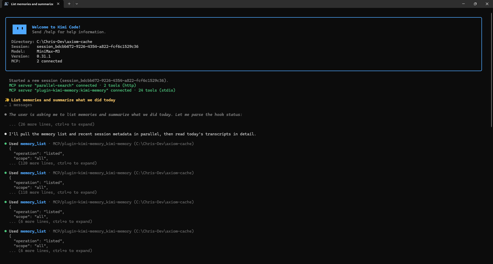
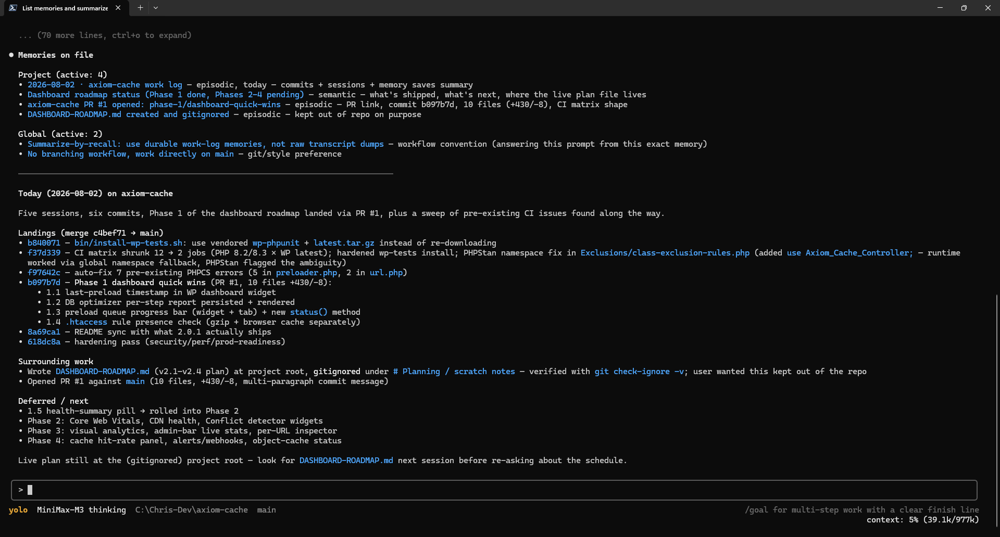

# Project Memory for Kimi Code

<p align="center">
  
  
</p>

A local Kimi Code plugin that provides three-layer memory — cross-project user memory, per-project durable + working memory, and per-project session archives — through MCP tools and lifecycle hooks.

## Layered model

| Layer                            | Path                                                      | Read default                          | Write default                | Lifetime                           |
| -------------------------------- | --------------------------------------------------------- | ------------------------------------- | ---------------------------- | ---------------------------------- |
| Global user memory               | `$KIMI_CODE_HOME/kimi-memory/_global/memory.sqlite`       | `scope: "all"` (merged) or `"global"` | `scope: "global"` (explicit) | Permanent; agent-curated.          |
| Project durable + working memory | `$KIMI_CODE_HOME/kimi-memory/<project-key>/memory.sqlite` | `scope: "project"` or `"all"`         | `scope: "project"` (default) | Permanent; agent-curated.          |
| Project session archive          | same path; `conversations` + `conversation_events`        | project-only, no scope                | automatic (hook-driven)      | Idempotent ingest of `wire.jsonl`. |

`<project-key>` is a SHA-256 prefix of the canonical project root. The global DB uses the literal `project_key = "_global"` so per-project queries never accidentally hit it.

## Requirements

- Kimi Code with plugin, hook, Skill, and MCP support
- Node.js ≥ 24 (`node:sqlite`; no native build required)

## Install

### From GitHub

In the Kimi Code chat input:

```text
/plugins install https://github.com/cbuntingde/kimi-memory
```

Kimi pulls the source into `$KIMI_CODE_HOME/plugins/managed/kimi-memory/`. On
its first MCP start, the plugin bootstraps the runtime dependencies from
`package-lock.json` with `npm ci`; no second manual install is required. The
plugin is not on the Kimi marketplace, so a trust prompt appears (default
**Cancel**); choose the affirmative option. Then run `/reload` and verify with
`/plugins info kimi-memory` — no diagnostic block means a clean install.

### From a local checkout

```bash
cd <path-to-this-repo>
npm install
```

Then from the Kimi chat input:

```text
/plugins install <absolute-path-to-this-repo>
/reload
```

Local sources are copied into the managed plugin directory; edits to this checkout do not propagate. Reinstall (and `/reload`) after meaningful changes. If the plugin is already installed, skip the install slash and just `/reload` after dependency changes — re-installing a healthy install copies the source again for no benefit.

## Use

- `/list_memories` — calls `memory_list` with `scope: "all"`.
- `/kimi-memory:list_memories` — namespaced fallback.
- `/kimi-memory:advisor` — reflection procedure over the active project (anchored recommendations, no remote calls). Also triggered by phrases like "would we change anything"; the auto-detect hook emits `[advisor] matched: ...`.
- `/kimi-memory:prune` — orphan-project DB cleanup (dry-run by default; `--apply` to delete).
- `/kimi-memory:memos` — open the companion `kimi-memos-dashboard` in the default browser (read-only view of every kimi-memory SQLite DB; the dashboard is a separate plugin the user starts).
- Natural language ("list memories", "remember this decision", "what did we decide?") invokes the same MCP tools when the Skill matches.

Every MCP call requires the active project's absolute root as `cwd` to prevent cross-project writes and supply provenance context.

## Environment variables

All optional; defaults are tuned for production.

| Variable                            | Default | Effect                                                                                                                                                           |
| ----------------------------------- | ------- | ---------------------------------------------------------------------------------------------------------------------------------------------------------------- |
| `KIMI_MEMORY_EMBEDDINGS`            | `on`    | Set to `off` to skip the embedding encoder. `memory_recall` falls back to FTS5-only; `memory_similar` returns `[]`.                                              |
| `KIMI_MEMORY_EMBED_TIMEOUT_MS`      | `4000`  | Wall-clock cap on a single embedding call; on timeout the row's `embedding_status` flips to `failed` with `last_embed_error = "embed_timeout: ..."`.             |
| `KIMI_MEMORY_AUTO_EXTRACT`          | `on`    | Set to `off` to disable the Stop-hook auto-extraction LLM call. Also configurable as `[kimi-memory] disable_auto_extract = true` in `config.toml`.               |
| `KIMI_MEMORY_SECRET_SCAN`           | `on`    | Set to `off` to bypass the server-side secret check on save (see Storage and privacy).                                                                           |
| `KIMI_MEMORY_PERF`                  | `on`    | Set to `off` to skip the `tests/16-perf.test.js` benchmarks.                                                                                                     |
| `KIMI_MEMORY_DISABLE_SESSION_FOCUS` | `off`   | Set to `1` to skip the Stop-hook session-focus capture (the "where we left off" memory).                                                                         |
| `KIMI_MEMORY_AUTO_GC`               | `on`    | Master switch for the auto-GC pipeline (prune + archive + tier). Set to `off` to skip every SessionStart pass.                                                   |
| `KIMI_MEMORY_AUTO_PRUNE`            | `on`    | Set to `off` to skip the auto-prune of dead rows (deleted / superseded / cold / orphans) while keeping the rest of the pipeline.                                 |
| `KIMI_MEMORY_AUTO_ARCHIVE`          | `on`    | Set to `off` to skip the auto-archive of `conversation_events` / `skill_invocations` / `persona_promotions`.                                                     |
| `KIMI_MEMORY_AUTO_TIER`             | `on`    | Set to `off` to skip the auto-tier promotion / demotion step.                                                                                                    |
| `KIMI_MEMORY_AUTO_MERGE`            | `on`    | Set to `off` to disable the auto-merge step that collapses tight clusters of sibling memories into the highest-confidence member (see Background consolidation). |

## Memory tools

The plugin exposes 46 MCP tools over the `kimi-memory` stdio server.

**Durable memory** (scope-aware; defaults shown):

- `memory_save(scope?, type, ...)` — `scope: "project"`. Accepts `synthesizes: [childId, ...]` for `conclusion` type to record lineage.
- `memory_recall(scope?, query, ...)` — `scope: "all"` (project first, then global). Hybrid FTS5 keyword + cosine over stored embeddings, fused via Reciprocal Rank Fusion (`fusion: 'rrf'` default with `rrf_k=60`; `fusion: 'weighted'` preserves the legacy 0.5/0.5 blend). Optional `visibility` and `tier` filters narrow both channels; `tier_budgets` caps per-tier selection; `max_chars_per_memory` and `max_total_recall_chars` shape the returned payload. Falls back to FTS5-only when embeddings are off.
- `memory_list(scope?, ...)`, `memory_get(scope?, id)` — both default `scope: "all"`.
- `memory_update(scope?, id, ...)` — `scope: "project"`.
- `memory_delete(scope?, id, hard?)` — `scope: "project"`. Soft by default; `hard: true` removes the row permanently.
- `memory_save_bulk(scope?, items)` — `scope: "project"`. Atomic batch save (1–500 items, single transaction); rolls back on any error. A later item with `supersede: true` can replace an earlier one sharing the same `(type, title)`.

**Similarity, edges, and synthesis** (scope-aware; defaults shown):

- `memory_similar(scope?, id, limit?, threshold?)` — closest to `id` by cosine. `threshold` ∈ [0, 1] (default 0.6); `limit` defaults to 10. Returns `[]` when the seed has no embedding. `scope: "all"`.
- `memory_link(scope?, from_id, to_id, kind, weight?)` — typed edge. `kind` ∈ `related | supports | contradicts | supersedes | synthesizes`; `weight` ∈ [0, 10], default 1.0.
- `memory_unlink(scope?, edge_id)`.
- `memory_edges(scope?, id, direction?, kind?)` — `direction`: `out | in | both` (default `both`); `kind` optional filter.
- `memory_merge(scope?, into_id, from_id, merged_content?, weight?)` — soft-supersede `from_id` into `into_id`; tag union plus `provenance.merge_from`; writes a `supersedes` edge `from_id → into_id`. Pass `merged_content` to overwrite `into_id`'s body; otherwise it is kept.
- `memory_reinforce(scope?, id)` — bump `confidence` by +0.05, stamp `last_accessed_at = now`. Idempotent.

**Working memory** (project-only):

- `working_memory_set`, `working_memory_get`, `working_memory_clear`

**Session archive** (project-only):

- `conversation_list`, `conversation_get`, `conversation_search`, `conversation_ingest`

**Higher-order** (project-aware reads; `conclusions_for`/`parents` accept `scope: "all"`):

- `memory_conclusions_for(scope?, child_id, limit?)` — conclusions synthesized from `child_id`.
- `memory_parents(scope?, conclusion_id, limit?)` — underlying memories for a conclusion.

**Combined summary**:

- `memory_status` — project + global durable-memory counts in one call.

**Maintenance**:

- `memory_prune(cwd, scope?, apply?)` — find (or, with `apply: true`, delete) project DBs whose canonical root no longer exists. `scope`: `"project"` (default, active only) or `"all-projects"` (every DB except active). Always dry-runs first. Active project and global DB are never removed.
- `memory_reset_project(cwd, confirm?)` — wipe the per-project rows (memories, working memory, conversations, conversation events, edges, synthesizes) so the project starts from a clean slate. Use after a repo is re-cloned to the same canonical path: the project_key is a hash of the path, so a re-clone is otherwise indistinguishable from the original. `confirm: false` (default) is a dry run that returns the row counts and a re-clone diagnostic; pass `confirm: true` to actually delete. The global database and every other project DB are never touched. The hook layer surfaces a `[stale-memory]` line on SessionStart and UserPromptSubmit when a re-clone is detected (directory birthtime newer than `first_seen_at`).

Successful memory operations return explicit metadata (`operation`, `scope`, counts, affected `id`).

### Scope and types

- **`scope: "all"` ordering**: results are sorted most-recent-first within each scope, then concatenated — every project row appears before every global row. A newer global row cannot outrank a stale project row.
- **Types**: `working` (active scratch), `episodic` (timestamped events), `semantic` (durable facts/decisions/rules), `procedural` (repeatable workflows), `conclusion` (synthesis over child memories; lineage recorded in `memory_synthesizes`), `skill` (v10 trigger-matching memory; metadata.trigger shape — `{ commands?, paths?, keywords? }` — is matched against tool invocations via `matchSkillTriggers`).
- **Supersede**: `memory_save` / `memory_save_bulk` with `supersede: true` mark prior `(type, title)` rows as `superseded` and stamp `supersedes` on the new row. No-op when no prior row exists.

### Standalone CLI

Same surface without the MCP server, via the `kimi-memory` bin entry:

```bash
kimi-memory list    [--cwd <path>] [--scope project|global|all] [--type <type>] [--limit N] [--json] [-q]
kimi-memory get     <memory-id> [--scope project|global] [--cwd <path>] [--json]
kimi-memory status  [--cwd <path>] [--json]
kimi-memory recall  <query> [--cwd <path>] [--limit N] [--per-type] [--json]
kimi-memory prune          [--cwd <path>] [--all-projects] [--apply] [--json]
kimi-memory reset-project  [--cwd <path>] [--apply] [--json]
kimi-memory acl list      <memory-id> [--cwd <path>] [--scope project|global] [--json]
kimi-memory acl grant     <memory-id> --principal-kind <k> --principal-id <id> [--cwd <path>] [--json]
kimi-memory acl revoke    <memory-id> --principal-kind <k> --principal-id <id> [--cwd <path>] [--json]
```

`--json` emits machine-readable JSON; `-q` suppresses per-row output; `--home <dir>` overrides `$KIMI_CODE_HOME`. `prune --apply` removes orphan project DBs whose canonical root no longer exists; `reset-project --apply` wipes the per-project rows of the active project (use after a re-clone). Both are dry runs by default.

## Higher-level features

### Vector similarity search

The `memories` table carries an optional 384-dim `embedding` (`BLOB`, float32). Every `memory_save`, `memory_recall`, `memory_save_bulk`, and `memory_merge` computes and stores an embedding by default; `memory_recall` runs FTS5 and cosine in parallel and merges the two ranked lists. The model is `Xenova/all-MiniLM-L6-v2` (~25 MB), fetched lazily from Hugging Face and cached locally. Set `KIMI_MEMORY_EMBEDDINGS=off` to skip new encoding; existing stored embeddings are still queryable, so `memory_similar` continues to work against rows that already have a vector. Encoding is wall-clock bounded at 4 s (`KIMI_MEMORY_EMBED_TIMEOUT_MS`); on timeout the row's `embedding_status` flips to `failed` and `last_embed_error` records the cause. The next call rides the in-flight load if it eventually lands.

### Edges

Edges (`memory_edges` table) are written by `memory_save(..., supersede: true)`, `memory_link(...)`, and `memory_merge(...)`. Listed via `memory_edges(scope, id, direction?, kind?)`; removed via `memory_unlink(scope, edge_id)`.

### Auto-extraction

The `Stop` hook (and `SessionEnd`, `PreCompact`, `Interrupt`, `StopFailure` that delegate to it) runs an idempotent auto-extract pass: reads the last six conversation summaries, asks the configured provider for up to three candidate memories, and saves the survivors through `memory_save` with `provenance.source = "auto_extract"` (visible on the dashboard as a purple `src-auto_extract` chip).

Cost guards: skips when there are fewer than 4 events, when the latest event is older than 30 minutes (override via `KIMI_MEMORY_EXTRACT_MAX_LATENCY_MS`), when the same `(type, title)` already exists, when the candidate looks like a transient task or is already covered by a recall hit, or when it contains a likely secret.

One short LLM call per Stop event to the model configured in `$KIMI_CODE_HOME/config.toml`. Disable via `KIMI_MEMORY_AUTO_EXTRACT=off` or `[kimi-memory] disable_auto_extract = true` in `config.toml`. The agent should still verify an auto-extracted batch before treating it as canon.

### Importance and decay

Every memory has `confidence` (default 0.8, range 0.1–1.0) and `access_count` / `last_accessed_at`. A background pass runs at every `SessionStart`:

- Rows newer than 30 days, or accessed within 30 days, are untouched.
- Older untouched rows decay 5% per 30 days, floored at 0.1. Decay uses `COALESCE(last_accessed_at, updated_at)`.

`memory_reinforce` is the manual nudge (see Durable memory); recall hits that the agent actually reads are good candidates.

### Higher-order `conclusion` type

Save with `memory_save({ type: "conclusion", synthesizes: [childId, ...] })`. Lineage is recorded in `memory_synthesizes` and queryable in both directions via `memory_conclusions_for` and `memory_parents`. Conclusions decay like any other row, but their child rows stay fresh while the conclusion is active — reinforce the conclusion itself.

### Brain mode (v9+)

`kimi-memory` v9 turns the plugin from a filing cabinet into something closer to a working brain, entirely through the hook layer:

- **Continuous retrieval** — every `UserPromptSubmit` recall query unions prompt tokens, working-memory slots, the session-focus title, and recent file paths. The top 3 hits are round-robined across memory types so the user sees a balanced recall, not three rows of the same type.
- **Mid-turn recall** — `PostToolUse` (a new hook event) surfaces `[tool-recall]` lines when a stored convention matches the tool's arguments (file paths, shell verbs). Cheap; no LLM call. Older Kimi versions that don't declare the event degrade silently.
- **Ebbinghaus decay** — every memory carries a per-row `stability_days` and `last_rehearsed_at`. Confidence is rewritten on `SessionStart` from the curve `0.1 + 0.9 * exp(-days / stability)`. Every `memory_reinforce` grows stability by 1.5x (cap 365 days) and stamps a fresh rehearsal. The hook auto-reinforces the top project recall hit with a 60-second debounce so the feedback loop is closed without manual calls.
- **Cross-session narrative** — `SessionStart` lists the last 3 sessions for the project, oldest → newest, with each session's focus title and body snippet. Pick-up phrasing: `Picking up the thread: <oldest session title>`.
- **Background consolidation ("dream pass")** — every `SessionStart`, related memories (cosine ≥ 0.75, ≥ 2 shared tags) are clustered; each cluster of ≥ 3 siblings without a `conclusion` child gets one synthesised. Idempotent via `memory_synthesizes` coverage check. Opt out via `KIMI_MEMORY_CONSOLIDATE=off`. **Auto-merge** additionally collapses _tight_ clusters (cosine ≥ 0.85, tag overlap ≥ 2, ≥ 3 members) by `memory_merge`-ing each sibling into the highest-confidence member, so a recall hit surfaces the synthesis body rather than a stack of redundant siblings. Siblings are soft-superseded (never hard-deleted); un-merge via the `merged_from` provenance chain. Opt out via `KIMI_MEMORY_AUTO_MERGE=off`.

Schema `SCHEMA_VERSION = 12` is the current migration target. The v9 bump added `stability_days` and `last_rehearsed_at`; the v10 bump added ACL/visibility columns (`visibility`, `shared_with`, `team_id`, `agent_id`, `user_id`, `session_id`, `task_id`) + `tier` + `persona_id` + the `metadata` column on `memory_edges`. Existing rows are backfilled on first open via column defaults; pre-v10 rows get `visibility='private'`, `shared_with='[]'`, `tier='L0'`, `stability_days=30`. The v11 bump made `memories_fts.project_key` and `memories_fts.type` indexed (probe-then-rebuild, idempotent).

### Auto-GC (background housekeeping)

`src/auto-gc.js` runs three independent, fail-open passes on every `SessionStart`, gated by per-project timestamps so the heavy work happens at most once per `AUTO_GC_THROTTLE_HOURS = 6` hours per project. Tier promotion is cheap (a few prepared statements) and runs every open; prune and archive are throttled. The throttle stamp lives in `schema_meta(key='auto_gc_last_run')` and is round-tripped through the same DB so a project that has never been GC'd runs on its first open.

| Pass             | What it does                                                                                                                                                                                                                                                                     | Tunables                                                  |
| ---------------- | -------------------------------------------------------------------------------------------------------------------------------------------------------------------------------------------------------------------------------------------------------------------------------- | --------------------------------------------------------- |
| `runAutoPrune`   | Hard-deletes rows that have been in their state past the grace window: explicit `deleted` after 30 days; soft-superseded after 90 days; embedding-failed after 30 days; cold rows (confidence < 0.05, zero accesses) after 365 days; orphans (parent hard-deleted) after 7 days. | `KIMI_MEMORY_AUTO_GC=off`, `KIMI_MEMORY_AUTO_PRUNE=off`   |
| `runAutoArchive` | Hard-deletes raw `conversation_events` after 180 days, raw `skill_invocations` after 90 days, raw `persona_promotions` after 365 days. The aggregate counters stay in the memory row's metadata; only the raw per-event rows drop.                                               | `KIMI_MEMORY_AUTO_GC=off`, `KIMI_MEMORY_AUTO_ARCHIVE=off` |
| `runAutoTier`    | Promotes active memories by access count: L0 → L1 at ≥ 3 accesses; L1 → L2 at ≥ 10 accesses; L2 → L3 at ≥ 5 accesses **AND** 30 days at L2. Demotes back to L0 when confidence falls below 0.2 for ≥ 14 days since the last rehearsal.                                           | `KIMI_MEMORY_AUTO_GC=off`, `KIMI_MEMORY_AUTO_TIER=off`    |

Each pass returns a counts object (`pruned_deleted`, `archived_conversation_events`, `promoted_l0_to_l1`, …) and is wrapped in a `SAVEPOINT`/`RELEASE` block so a single failure aborts only its own category. The SessionStart status line carries a short `auto_gc=` segment: `auto_gc=tier:prom:2/dem:0/heavy:throttled` when the heavy passes were skipped this open, `auto_gc=prune:3/archive:12/tier:prom:5/dem:1` when they ran. Errors surface as `auto_gc=err:<message>`.

Why this exists: without it, every project DB grows unbounded — soft-deletes linger forever, every Stop event appends a `persona_promotions` row, every tool call appends a `conversation_event`. With a 6-hour throttle, the on-open cost is amortised to near-zero and the database size stays bounded.

### Session focus — "where we left off"

The `Stop` hook (and the lifecycle hooks that delegate to it) writes a `working`-typed memory titled `Last focus: <truncated latest user prompt>` whenever the session has at least one user prompt. The memory body lists the last few user prompts from the session so the next session has the thread to pick up. Tags: `focus`, `session-focus`, `in-flight`. `expires_at` is set 30 days out so the row auto-cleans when no longer relevant.

This is the answer to "close kimi-code, reopen, ask what we were working on". The next `SessionStart` reads the most recent focus row and emits a one-line preview:

```text
[focus] "Last focus: narrow it down to the embed timeout edge case" (working) — Most recent user requests in this session (oldest → newest):
```

`UserPromptSubmit` emits the same line on every prompt, regardless of keyword match — it is the agent's signal that the user can simply say "continue" or "pick that up" and the prior focus is already in context. The status line gains a `focus=saved|updated|skip:<reason>` segment mirroring the `extract=` and `work_log=` shape.

Auto-extract deliberately skips transient tasks (see Auto-extraction above), so the focus capture fills the gap that the LLM is not asked about. Cost: zero — the row is built from `conversation_events.summary`, no LLM call. Disable via `KIMI_MEMORY_DISABLE_SESSION_FOCUS=1`.

## ACL / visibility (v10)

Ported from TencentDB-Agent-Memory. Every memory carries one of five visibility levels plus a list of principal descriptors and an explicit grant table. The default for every new save is `private`; rows are never accidentally cross-project visible.

| Visibility   | Meaning                                                     | Default? |
| ------------ | ----------------------------------------------------------- | -------- |
| `private`    | Only the owning project sees the row.                       | yes      |
| `team`       | Visible to any row tagged with the project's team identity. | no       |
| `restricted` | Visible only to grants listed in `shared_with`.             | no       |
| `agent`      | Visible to the named agent identity.                        | no       |
| `task`       | Visible only while the row's task is open.                  | no       |

**New MCP tools**:

- `acl_grant({cwd, memory_id, principal_kind, principal_id})` — insert an ACL grant (`principal_kind ∈ {user, team, role, agent}`).
- `acl_revoke(...)` — remove an ACL grant.
- `acl_list({cwd, memory_id})` — list every grant for a memory.
- `acl_share_memory({cwd, memory_ids, visibility, shared_with?, to_shared_pool?})` — promote rows to a new visibility level. With `to_shared_pool: true` the row is physically moved to the cross-project shared DB at `$KIMI_CODE_HOME/kimi-memory/_shared/memory.sqlite` (literal `project_key='_shared'`); without it, the row stays in its project DB and only `visibility` + `shared_with` change.
- `acl_resolve_principal({cwd, descriptor})` — parse a `kind:id` descriptor into parts.

`memory_recall` accepts an optional `visibility: 'team' | ['private', 'team']` filter that narrows both the FTS and the vector channels. `memory_save`, `memory_save_bulk`, and `memory_update` accept the shared ACL fields `visibility` + `shared_with`; identity columns (`team_id` / `agent_id` / `user_id` / `session_id` / `task_id`) exist on the row but are populated by the hook layer, not the MCP tool surface. See `CONVENTIONS.md §7` for the rationale.

**CLI additions**:

```text
node src/cli.js acl list   <memory-id> [--cwd <path>] [--scope project|global] [--json]
node src/cli.js acl grant  <memory-id> --principal-kind <k> --principal-id <id> [--cwd <path>] [--json]
node src/cli.js acl revoke <memory-id> --principal-kind <k> --principal-id <id> [--cwd <path>] [--json]
```

**Layout**: four logical DBs now exist under `$KIMI_CODE_HOME/kimi-memory/`:

- `<project-key>/memory.sqlite` — per-project durable + working memory + conversations.
- `_global/memory.sqlite` — cross-project user durable memory.
- `_shared/memory.sqlite` — ACL-promoted cross-project pool (new in v10; lazily created on first `acl_share_memory` call with `to_shared_pool: true`).
- `_diagnostics/hooks.log` — hook + advisor diagnostics (one log file for the whole plugin).

`schema_meta(key, value)` is also stored in every per-project DB. The persistence layer uses it to carry per-DB config such as the `auto_gc_last_run` throttle stamp; the migrations runner reads `schema_version` from the same table.

## Conversation archival

Hooks run at `SessionStart`, `UserPromptSubmit`, `Stop`, `SessionEnd`, `PreCompact`, `Interrupt`, and `StopFailure`. They incrementally read the current session's `agents/main/wire.jsonl`, preserve every raw JSONL event, and extract searchable summaries. Imports use byte and line cursors and are idempotent. Kimi does not document full conversation text in hook payloads, so archival reads the transcript files directly without modifying them; the parser is tolerant of unknown/malformed records.

`SessionStart` and `UserPromptSubmit` emit a structured status line plus a short summary line. The status line reports project key, active/global memory counts, working-slot count, conversations, conversation events, ingest status, and (for `UserPromptSubmit`) project/global recall hit counts:

```text
[kimi-memory] event=UserPromptSubmit project_key=59e809561f923b9f pmem.active=0 gmem.active=1 wm=0 conv=3 events=354 ingest=ok:2 consolidate=saved:0/skipped:0 auto_gc=tier:prom:0/dem:0/heavy:throttled recall project:0 global:0 cwd=...
```

Summary lines are intentionally short:

- SessionStart: `Loaded N recent memories. (N project, N global.)` or `No recent memories.`
- UserPromptSubmit: `Recalled N memory/memories. (N project, N global.) [semantic: 2, procedural: 1]` (per-type breakdown appended when there are hits) or `No recall hits.`

`UserPromptSubmit` also writes a trailing JSON object on stdout with two fields: `systemMessage` (the human-readable lines above — terminal stays clean) and `hookSpecificOutput.additionalContext` (a numbered, AI-facing list of recall hits: `1. (semantic, project, score=0.02) "title" — <body snippet>`, snippet capped at 120 chars). The model sees the recall hits in `additionalContext`; the human sees the counts and types in `systemMessage`. When no hits exist, `additionalContext` is omitted entirely (no "no recall hits" spam on every turn).

When a session-focus row exists, `[focus] "<title>" (working) — <body snippet>` is also emitted (always, not gated on keyword recall — see Session focus above). Working-memory slots are emitted as `- WM <slot>: <value>` lines. The remaining hooks are silent on stdout and run only the idempotent project-session ingest; they are fail-open and never block Kimi's lifecycle. The hooks never echo full memory bodies, raw prompts, or session transcripts.

An advisor match line appears on `UserPromptSubmit` when the prompt contains a frozen keyword:

```text
[advisor] matched: "would we change" — /advisor or ask naturally; skill `advisor` is loaded
```

The frozen list lives in `src/advisor/detect.js`; a per-sentence negation gate suppresses matches when the keyword shares a sentence with negation markers.

## Storage and privacy

Each project is SHA-256 keyed and stored separately:

```text
$KIMI_CODE_HOME/kimi-memory/<project-key>/memory.sqlite
$KIMI_CODE_HOME/kimi-memory/_global/memory.sqlite
```

Hook diagnostics:

```text
$KIMI_CODE_HOME/kimi-memory/_diagnostics/hooks.log          # every hook (SessionStart, UserPromptSubmit, Stop, SessionEnd, PreCompact, Interrupt, StopFailure, PostToolUse) + the advisor keyword detector
```

Local-first: SQLite databases live under `$KIMI_CODE_HOME/kimi-memory/`; the plugin never writes into Kimi's `sessions` tree. Two outbound behaviours:

- The MiniLM model (~25 MB) downloads lazily from Hugging Face on first use and caches locally. Disable with `KIMI_MEMORY_EMBEDDINGS=off`.
- Auto-extraction sends one short LLM call per Stop event to the model in `config.toml`. The conversation transcript included in that call is **scrubbed server-side** with `redactSecrets` (OpenAI, Anthropic, GitHub, AWS, JWT, PEM, `key=…`, `Authorization: Bearer` shapes) before it leaves the machine — credentials a user typed in chat never reach the configured LLM provider. Disable with `KIMI_MEMORY_AUTO_EXTRACT=off` or `[kimi-memory] disable_auto_extract = true`.

Caveats:

- Conversation archives may contain prompts, model responses, tool arguments, and tool output — protect the Kimi data directory.
- `saveMemory` runs `looksLikeSecret` on `title`, `content`, every `tags` entry, and every string value in `metadata` (recursively). It refuses to persist known credential shapes (OpenAI, Anthropic, GitHub, AWS, JWT, PEM, `key=…`, `Authorization: Bearer`). The check is enforced at the lowest layer so every write path (`memory_save`, `memory_update`, `memory_merge`, `memory_save_bulk`, auto-extract) inherits it; `memory_save_bulk` rolls back the whole batch on a single bad item. Opt out via `KIMI_MEMORY_SECRET_SCAN=off` only for legitimate test fixtures. False positives are preferred over persisting a real secret.
- The plugin never lazy-creates the global DB on a read; it only opens an existing global DB or accepts an explicit global save. Write paths (the MCP server's record-on-write helpers, `acl_share_memory` in-place promotion, `memory_reset_project` confirm=true) DO create the directory on first write, but a `memory_recall` / `memory_list` / `memory_status` over `scope: 'global'` against a fresh install will not create any files.

## Reading `memory_status`

```jsonc
{
  "project_key": "59e809561f923b9f",
  "cwd": "C:/projects/example",
  "memories": {
    "total": 12, // every row in the memories table
    "active": 8, // status='active' and not expired
    "retained": 4, // superseded + soft-deleted + expired — still on disk
    "expired": 1,
    "superseded": 2,
    "deleted": 1,
    "by_type": { "semantic": 5, "procedural": 3, "episodic": 0, "working": 0 },
    "by_status": { "active": 8, "superseded": 2, "deleted": 1 },
    "latest_update_at": "2026-07-27T19:35:15.985Z",
  },
  "working_memory_slots": 2,
  "conversations": 1,
  "conversation_events": 8,
  "global": {
    "memories": {
      "total": 3,
      "active": 3,
      "retained": 0,
      "by_type": { "semantic": 2, "procedural": 1 },
      "latest_update_at": "2026-07-26T18:00:00.000Z",
    },
  },
  "scopes": { "project": "59e809561f923b9f", "global": "_global" },
}
```

Top-level fields describe the project layer; `global.memories` describes the cross-project layer; `scopes` reports the literal project key and the literal `"_global"` string used in the `project_key` column.

## Schema

`SCHEMA_VERSION` is `12`. Databases are migrated in place on first open; migrations are idempotent and append a new column or table when missing. Current schema additions: `project_paths` (canonical project root per DB, drives `memory_prune`); `last_embed_error` on `memories` (failed embeddings are observable); `last_canonical_root` + `record_count` on `project_paths` (preserves prior root on re-record); `stability_days` + `last_rehearsed_at` (Ebbinghaus decay, v9); `visibility` + `shared_with` + 5 nullable principal identity columns + `memories_acl` grant table (v10); `schema_meta(key, value)` carries `schema_version` and the `auto_gc_last_run` throttle stamp.

The persistence layer is split into focused modules under `src/persist/` (connection, memories, search, reinforce, edges, share, skills, project + a barrel re-export). The top-level `src/persist.js` is a 6-line backward-compatibility shim that re-exports the barrel, so existing `import { … } from './persist.js'` call sites keep working unchanged.

## Recent changes (v0.5.1)

Auto-GC + auto-merge + persist split + AI-facing recall context.

**New features**:

- `src/auto-gc.js` — three independent, fail-open passes (auto-prune, auto-archive, auto-tier) run on every `SessionStart`. Tier promotion runs every open; prune + archive are throttled to once per 6 hours per project via `schema_meta(auto_gc_last_run)`. Env opt-outs: `KIMI_MEMORY_AUTO_GC=off` (master), `KIMI_MEMORY_AUTO_PRUNE=off`, `KIMI_MEMORY_AUTO_ARCHIVE=off`, `KIMI_MEMORY_AUTO_TIER=off`. Status line gains an `auto_gc=` segment.
- `runConsolidate` now calls `mergeMemory` on tight clusters (cosine ≥ 0.85, tag overlap ≥ 2, ≥ 3 members) so the siblings are folded into the highest-confidence member and a recall hit surfaces the synthesis body rather than redundant copies. Siblings are soft-superseded, never hard-deleted. Opt out via `KIMI_MEMORY_AUTO_MERGE=off`.
- `UserPromptSubmit` now writes a trailing JSON object on stdout with `systemMessage` (the human-readable lines) and `hookSpecificOutput.additionalContext` (a numbered list of recall hits the model can acknowledge). The verbose per-memory `[recall: i/N]` lines are routed to `additionalContext` only — the terminal stays clean.

**Internal refactor**:

- The 3,423-line `src/persist.js` was split into focused modules under `src/persist/`: `connection.js` (schema + openDb), `memories.js` (CRUD + helpers + synthesis), `search.js` (RRF + recall + backfill), `reinforce.js` (reinforce + decay), `edges.js` (typed edges), `share.js` (visibility / tier / persona / wiki), `skills.js` (skill triggers + invocations), `project.js` (working memory + conversations + project_paths + reset), `re-exports.js` (tool-registry + codegraph). The top-level `src/persist.js` is now a 6-line barrel; every existing `import { … } from './persist.js'` call site works unchanged.
- `src/search.js` (109 lines) holds the FTS5 query helpers (`normalizeFts5Query`, `buildTitleBoostedQuery`, `buildOrderByClause`) that `persist/search.js` consumes. `src/concurrency.js` (94 lines) holds the per-process write-counter used for diagnostics; the two helpers (`isSqliteBusyError`, `getConcurrencyStatus`) are exported for the dashboard. The previous v0.5.0 "dead code removed" line for these two files is now stale — both ship in v0.5.1 with new content.
- `scripts/check-syntax.js` replaces the hand-maintained &&-chained `node --check` list in `package.json`. The script walks `src/`, `hooks/`, and `tests/`, runs `node --check` on every `.js` file, and reports failures file-by-file. The previous list had drifted out of sync with the tree (it still referenced `src/concurrency.js` and `src/search.js` after their deletion in v0.5.0).

**Tests**:

- New `tests/33-auto-gc-smoke.test.js` (synthetic DB + the three auto-GC passes + the `schema_meta` throttle stamp).
- `tests/04-hooks.test.js` and `tests/13-recall-per-type.test.js` updated for the new `hookSpecificOutput.additionalContext` shape.

For the v0.5.0 audit fixes (path-traversal, `redactSecrets`, RRF-vs-O(N²), `bumpAccess` collapse, etc.) see the commit log; the audit landed in two commits (`d9ddf33` and `fa8576c`).

## Uninstall and data retention

- `/plugins remove kimi-memory` (or `D` in the Installed tab) deletes the installation record but leaves the managed copy and memory databases on disk.
- Remove the managed copy: `rm -rf "$KIMI_CODE_HOME/plugins/managed/kimi-memory"`.
- Memory databases live under `$KIMI_CODE_HOME/kimi-memory/<project-key>/` and `$KIMI_CODE_HOME/kimi-memory/_global/`. Wipe everything: `rm -rf "$KIMI_CODE_HOME/kimi-memory/"`.
- For orphan-project cleanup only, use `/kimi-memory:prune` (or `memory_prune(scope: "all-projects")`) — dry-run by default, then `apply: true` to delete. The global DB and the active project's DB are always preserved.

## Development

```bash
npm install
npm run check             # node --check on every source file
npm test                  # node --test tests/*.test.js
npm run format:check      # prettier --check on every tracked file
npm run backfill-embeddings
```

The `assets/` directory holds the static assets shipped with the plugin (`icon.svg` plus a small `README.md`) and is kept under version control so the manifest and tests can rely on a stable relative path.

## Official references

- [Plugins](https://www.kimi.com/code/docs/en/kimi-code-cli/customization/plugins.html)
- [Hooks](https://www.kimi.com/code/docs/en/kimi-code-cli/customization/hooks.html)
- [MCP](https://www.kimi.com/code/docs/en/kimi-code-cli/customization/mcp.html)
- [Skills](https://www.kimi.com/code/docs/en/kimi-code-cli/customization/skills.html)
- [Slash commands](https://www.kimi.com/code/docs/en/kimi-code-cli/reference/slash-commands.html)
- [Data locations](https://www.kimi.com/code/docs/en/kimi-code-cli/configuration/data-locations.html)
